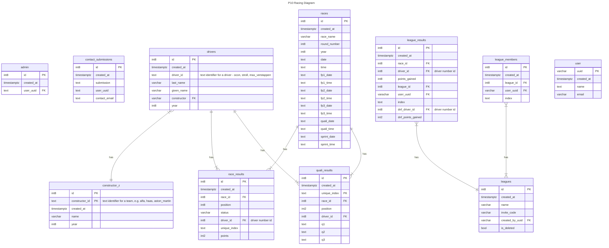

```mermaid
---
title: P10 Racing Diagram
---
erDiagram
admin {
	int8 id PK
	timestamptz created_at
	text user_uuid FK
}
constructor_z {
	int8 id PK
	text constructor_id PK "text identifier for a team, e.g. alfa, haas, aston_martin"
	timestamptz created_at
	varchar name
	int8 year
}
contact_submissions {
	int8 id PK
	timestamptz created_at
	text submission
	text user_uuid
	text contact_email
}
drivers }|--|| constructor_z : has
drivers {
	int8 id PK
	timestamptz created_at
	text driver_id "text identifier for a driver - ocon, stroll, max_verstappen"
	varchar last_name
	varchar given_name
	varchar constructor FK
	int8 year
}
league_members {
	int8 id PK
	timestamptz created_at
	int8 league_id FK
	varchar user_uuid FK
	text index
}
league_results {
	int8 id PK
	timestamptz created_at
	int8 race_id FK
	int8 driver_id FK "driver number id"
	int8 points_gained
	int8 league_id FK
	varachar user_uuid FK
	text index
	int8 dnf_driver_id FK "driver number id"
	int2 dnf_points_gained
}
league_results }|--|| leagues : has
league_members }|--|{ leagues : has
leagues {
	int8 id PK
	timestamptz created_at
	varchar name
	varchar invite_code
	varchar created_by_uuid FK
	bool is_deleted
}
quali_results {
	int8 id PK
	timestamptz created_at
	text unique_index PK
	int8 race_id FK
	int2 position
	int8 driver_id FK
	text q1
	text q2
	text q3
}
race_results {
	int8 id PK
	timestamptz created_at
	int8 race_id FK
	int8 position
	varchar status
	int8 driver_id FK "driver number id"
	text unique_index
	int2 points
}
races ||--|{ race_results : has
races ||--|{ quali_results : has
drivers ||--|{ race_results : has
drivers ||--|{ quali_results : has
races {
	int8 id PK
	timestamptz created_at
	varchar race_name
	int8 round_number
	int8 year
	text date
	text time
	text fp1_date
	text fp1_time
	text fp2_date
	text fp2_time
	text fp3_date
	text fp3_time
	text quali_date
	text quali_time
	text sprint_date
	text sprint_time
}
user {
	varchar uuid PK
	timestamptz created_at
	text name
	varchar email
}
```